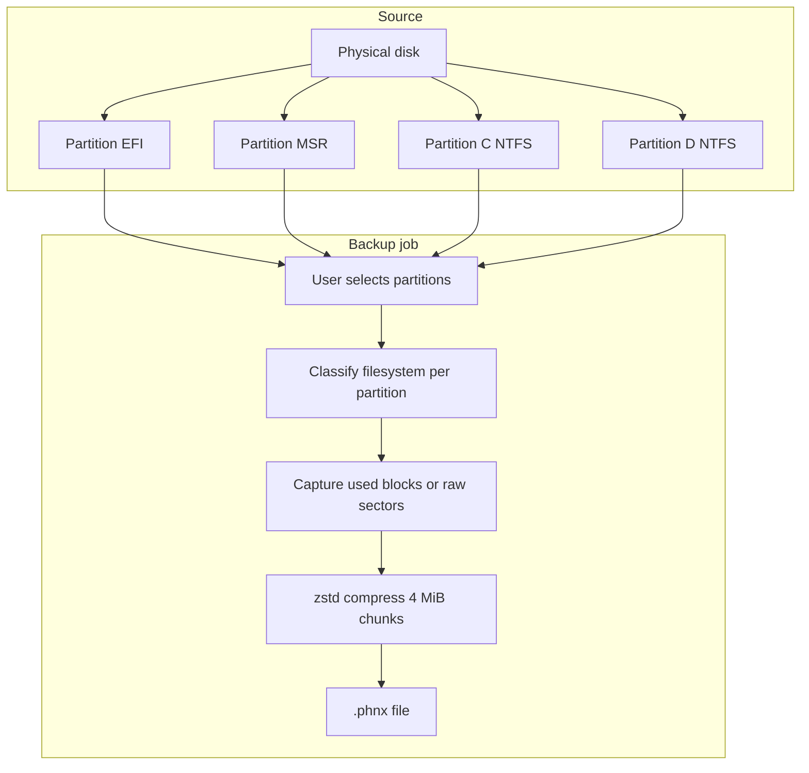

# Carbon Phoenix — Backup Guide

This document explains how backups work in Carbon Phoenix, what options you have, and how to choose settings for different scenarios.

For the on-disk file layout, see [docs/phnx-format.md](docs/phnx-format.md). For restore, see the main [README.md](README.md#cli-usage) restore section.

---

## What a backup is (and is not)

Carbon Phoenix does **not** create a monolithic sector-by-sector image of an entire physical disk (unlike many tools in “dd” or Clonezilla full-disk mode).

Instead, each backup is a single **`.phnx`** file that contains:

1. **Disk metadata** — GPT or MBR style, disk signature, timestamp, hostname.
2. **One stream per selected partition** — compressed payload plus a sparse map of which sectors/clusters were captured.
3. **A JSON manifest** — per-partition filesystem type, capture mode, sizes, and BLAKE3 hashes for every 4 MiB chunk.

You choose **which partitions** on **which disk** to include. Unselected partitions are not read and do not appear in the file.



---

## Capture modes

Each partition is backed up using one of two capture strategies.

### Used-block capture (`used-blocks`)

**Applies to:** NTFS, FAT, and exFAT data partitions when the filesystem is detected on the volume.

**Behavior:**

- Reads the filesystem allocation information (NTFS `$BITMAP`, FAT allocation table, etc.).
- Backs up **only allocated clusters** plus necessary metadata regions (e.g. boot sector area).
- **Free space inside the partition is skipped** — the backup file stays much smaller than the partition size.
- Empty space is **not** preserved; restore targets a partition that you size explicitly in a restore plan.

This is the default for Windows data volumes and is the main reason Carbon Phoenix avoids “full imaging” bloat.

### Raw sector capture (`raw`)

**Applies to:**

- EFI System Partition
- Microsoft Reserved (MSR)
- Partitions with unknown or undetected filesystem
- Any partition explicitly treated as unknown

**Behavior:**

- Reads **every sector** in the partition sequentially (still stored as sparse extents and compressed chunks in `.phnx`, but the extent list covers the full partition span).
- Required for boot-related small partitions where filesystem-level “used block” logic does not apply.

For a typical Windows 11 disk, EFI + MSR are raw (small); `C:` and `D:` are used-block if detected as NTFS.

| Partition type | Typical capture mode | Approximate backup size |
|----------------|----------------------|-------------------------|
| EFI System | Raw | Tens–hundreds of MB |
| MSR | Raw | ~16 MB |
| NTFS (C:, D:, …) | Used-blocks | Close to **used** space, not partition size |
| FAT / exFAT | Used-blocks | Allocated clusters + metadata |
| Unknown | Raw | Full partition size |

---

## Runtime: live Windows vs offline (WinPE)

The same `.phnx` format is written in both environments. What changes is **how volumes are opened for reading**.

### Direct read (default)

- Opens the volume (`\\.\C:`) or partition on the physical disk (`\\.\PhysicalDriveN` at offset).
- Appropriate when:
  - Running from **WinPE** with volumes offline or quiesced.
  - Backing up **non-system** data drives while nothing critical is locking files.
  - You have stopped apps that hold exclusive locks (best effort).

### Live backup with VSS (`--vss` / GUI “Use VSS”)

- Uses Windows **Volume Shadow Copy Service** to create a point-in-time snapshot, then reads from the shadow copy device.
- Appropriate when:
  - Backing up **C:** or other in-use system volumes from a running Windows session.
  - You need a crash-consistent / application-consistent view without rebooting to WinPE.

**Important:** VSS does **not** change capture mode. It only changes the **read source** to a frozen snapshot. NTFS volumes still use used-block capture when detected; EFI/MSR still use raw.

VSS requires:

- Administrator privileges (UAC).
- The Volume Shadow Copy service available (standard on desktop Windows).
- On failure, the tool may fall back to reading the live volume directly (logged); WinPE backups should leave VSS disabled.

BitLocker volumes must be **unlocked** (decrypted at the volume layer) for any read path. Suspended or locked volumes are not supported.

---

## Backup process (step by step)

1. **Enumerate disks** — `\\.\PhysicalDrive0`, `1`, … via Win32 APIs; GPT/MBR layout and partition list.
2. **Detect filesystem** — Per-volume `GetVolumeInformationW` when a drive letter is mapped; GPT type GUID for EFI/MSR.
3. **User selection** — Disk index + partition index list (CLI) or checkboxes (GUI).
4. **Per partition:**
   - Resolve read path (volume, shadow copy, or disk offset).
   - Plan extents (used clusters or full-sector range).
   - Read data in up to **4 MiB** chunks.
   - Compress each chunk with **zstd** (level 3).
   - Hash uncompressed chunk with **BLAKE3**; record in manifest.
5. **Finalize** — Write partition index table, JSON manifest, footer with manifest hash.

Integrity is recorded **during** backup; use `carbon-phoenix verify` afterward for a full re-read check.

---

## Output: the `.phnx` file

- **Single file** per backup job (not a folder of loose images).
- **Not** a generic ZIP/7z archive — custom layout for streaming restore and per-chunk verification.
- Typical extension: `.phnx`.
- Contains only selected partitions; restoring “whole disk” means restoring **each included partition** to planned offsets on a target disk (see restore plan).

After backup, inspect contents:

```bash
carbon-phoenix list backup.phnx
```

Look at `used_bytes` vs `original_size` per partition to see how much logical data was captured versus partition capacity.

---

## CLI reference

### List disks and partitions

```bash
carbon-phoenix list-disks
```

Shows disk index, path, GPT/MBR, and each partition’s index, name, size, detected filesystem, and capture mode.

### Create a backup

```bash
carbon-phoenix backup --disk <DISK_INDEX> --partitions <INDEX>[,<INDEX>...] --output <PATH.phnx> [--vss]
```

| Option | Required | Description |
|--------|----------|-------------|
| `--disk` | Yes | Physical disk number (from `list-disks`). |
| `--partitions` | Yes | Comma-separated partition indices on that disk. |
| `--output` / `-o` | Yes | Path to the output `.phnx` file. |
| `--vss` | No | Use VSS snapshots for volume-backed partitions (live system backup). |

**Examples:**

```bash
# Data drive only, offline-style read
carbon-phoenix backup --disk 1 --partitions 2 --output D:\Backups\data.phnx

# System disk: EFI + MSR + Windows partition (indices from list-disks)
carbon-phoenix backup --disk 0 --partitions 1,2,3 --output C:\Backups\system.phnx --vss

# Single NTFS volume with shadow copy
carbon-phoenix backup --disk 0 --partitions 3 --output C:\Backups\c-drive.phnx --vss
```

### Verify after backup

```bash
carbon-phoenix verify backup.phnx          # Full: re-hash every chunk
carbon-phoenix verify backup.phnx --quick  # Metadata + manifest hash only
```

---

## GUI reference

Launch `carbon-phoenix-gui.exe` (Administrator / UAC).

**Backup tab:**

1. **Disk** — Dropdown of physical drives.
2. **Partitions** — Checkboxes; only checked partitions are included.
3. **Save backup to** — Path field; **Browse** or **Start backup** opens a Save dialog.
4. **Use VSS (live Windows)** — Enable for in-use system volumes on a running OS.
5. **Progress** — Bottom panel shows phase, detail, and a progress bar while the job runs (background thread).

Controls are disabled until the job finishes.

---

## Choosing partitions for common goals

### Full system recovery (same or replacement disk)

Include at minimum on the system disk:

- EFI System Partition
- MSR (if present)
- Windows NTFS partition (e.g. `C:`)

Use **VSS** when creating the backup from a running system. From WinPE, leave VSS off and ensure you are not backing up the disk you booted from unless intentional.

### Data-only backup

Select only data partitions (e.g. `D:`). VSS optional; often not needed if no heavy writers.

### Minimal backup

Select only the partitions you need to restore. Omit recovery partitions, OEM tools, or other disks unless you have a reason to include them.

---

## Progress bar behavior

The GUI (and shared progress API) tracks work as follows:

- **Numerator:** Bytes actually read and written into the archive (compressed stream payload).
- **Denominator (current implementation):** Sum of **partition capacities** (`size_bytes`) for all selected partitions.

If you select ~954 GB of partition **capacity** but only ~150 GB of **used** data, the bar may show a low percentage for most of the run and jump to 100% at completion. That does **not** mean it is still copying 954 GB; the label is conservative.

Use `list backup.phnx` and the final file size on disk to judge real progress.

---

## NTFS used-space detection (current limitation)

Used-block backup for NTFS depends on reading the volume’s **cluster bitmap**. The implementation is still improving: if the bitmap cannot be read from the volume, the tool may assume **all clusters are allocated** as a safe fallback. In that case, an NTFS partition backup can approach **full partition size** even though the mode is labeled `used-blocks`.

Symptoms:

- Backup takes as long as a full-volume read.
- `.phnx` size is close to the sum of NTFS partition sizes.

If you see this, the backup is still **not** imaging unselected partitions or other disks — but it may be reading most of each selected NTFS partition. Check `used_bytes` in `list` output after completion.

---

## Requirements and limitations

| Topic | Requirement |
|-------|-------------|
| Privileges | Administrator (embedded in executables). |
| OS | Windows **x64** or **ARM64** for backup (same features on both); WinPE supported for offline capture — use the PE that matches WinPE architecture ([docs/WINDOWS-ARM64.md](docs/WINDOWS-ARM64.md)). |
| BitLocker | Volume must be unlocked; backup reads decrypted content. |
| Encryption | Backups are **not** encrypted in v1; protect the `.phnx` file like sensitive data. |
| Incremental | Full backup only in v1; file format reserves fields for future incrementals. |
| Network | Write `.phnx` to local or mapped path; no built-in cloud upload in v1. |
| macOS / Linux | Not supported as backup sources in v1. |

---

## What gets stored in the manifest (per partition)

Useful fields for auditing a backup:

- `fs` — `ntfs`, `fat`, `exfat`, `efi`, `msr`, `unknown`
- `capture_mode` — `raw` or `used-blocks`
- `original_size` — Partition size at backup time
- `used_bytes` — Logical bytes captured (good indicator of real workload)
- `chunks` — Count and BLAKE3 hashes for verification
- `bitmap_hash` — Optional; reserved for future incremental bitmap comparison

---

## Quick decision checklist

| Question | Suggestion |
|----------|------------|
| Backing up `C:` while Windows is running? | Enable **VSS**. |
| In WinPE? | Disable VSS; select correct `PhysicalDrive`. |
| Need boot recovery? | Include **EFI + MSR + Windows** partition. |
| Only files on `D:`? | Select **D:** only; VSS optional. |
| Backup seems huge? | Run `list`; compare `used_bytes` vs `original_size`; see NTFS bitmap note above. |
| Progress stuck at low %? | Denominator is partition size, not used size; check output file growth. |

---

## Related commands

```bash
carbon-phoenix list-disks
carbon-phoenix backup --disk 0 --partitions 1,2,3 -o backup.phnx --vss
carbon-phoenix list backup.phnx
carbon-phoenix verify backup.phnx
```

Restore workflow: `plan` → edit TOML → `restore` (documented in [README.md](README.md)).
