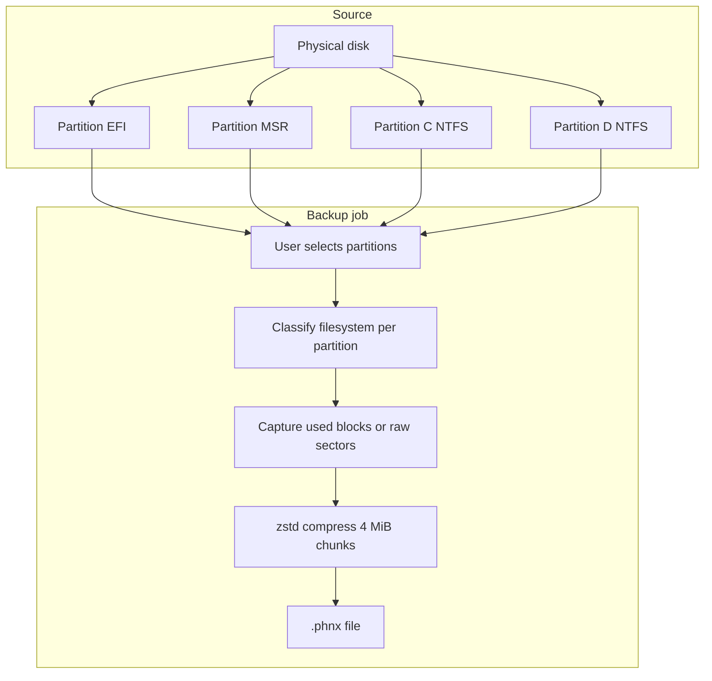

# Carbon Phoenix — Backup Guide

This document explains how backups work in Carbon Phoenix, what options you have, and how to choose settings for different scenarios.

For the on-disk file layout, see [docs/phnx-format.md](docs/phnx-format.md). For restore, see the main [README.md](README.md#cli-usage) restore section.

---

## What a backup is (and is not)

Carbon Phoenix does **not** create a monolithic sector-by-sector image of an entire physical disk (unlike many tools in “dd” or Clonezilla full-disk mode).

Instead, each backup is a single **`.phnx`** file that contains:

1. **Disk metadata** — GPT or MBR style, disk signature, timestamp, hostname.
2. **One stream per selected partition** — compressed payload plus a sparse map of which sectors/clusters were captured.
3. **A JSON manifest** — per-partition filesystem type, capture mode, sizes, and BLAKE3 hashes for every 4 MiB chunk.

You choose **which partitions** on **which disk** to include. Unselected partitions are not read and do not appear in the file.



---

## Capture modes

Each partition is backed up using one of two capture strategies.

### Used-block capture (`used-blocks`)

**Applies to:** NTFS, FAT, and exFAT data partitions when the filesystem is detected on the volume.

**Behavior:**

- Reads the filesystem allocation information (NTFS `$BITMAP`, FAT allocation table, etc.).
- Backs up **only allocated clusters** plus necessary metadata regions (e.g. boot sector area).
- **Free space inside the partition is skipped** — the backup file stays much smaller than the partition size.
- Empty space is **not** preserved; restore targets a partition that you size explicitly in a restore plan.

This is the default for Windows data volumes and is the main reason Carbon Phoenix avoids “full imaging” bloat.

### Raw sector capture (`raw`)

**Applies to:**

- EFI System Partition
- Microsoft Reserved (MSR)
- Partitions with unknown or undetected filesystem
- Any partition explicitly treated as unknown

**Behavior:**

- Reads **every sector** in the partition sequentially (still stored as sparse extents and compressed chunks in `.phnx`, but the extent list covers the full partition span).
- Required for boot-related small partitions where filesystem-level “used block” logic does not apply.

For a typical Windows 11 disk, EFI + MSR are raw (small); `C:` and `D:` are used-block if detected as NTFS.

| Partition type | Typical capture mode | Approximate backup size |
|----------------|----------------------|-------------------------|
| EFI System | Raw | Tens–hundreds of MB |
| MSR | Raw | ~16 MB |
| NTFS (C:, D:, …) | Used-blocks | Close to **used** space, not partition size |
| FAT / exFAT | Used-blocks | Allocated clusters + metadata |
| Unknown | Raw | Full partition size |

---

## How a source is frozen (no switch — the engine picks)

A backup is only trustworthy if the bytes it reads can't change underneath it. There is **no user setting** for this: for every partition, the engine takes the strongest freeze the volume allows, in this order.

### 1. Exclusive volume lock (preferred)

- Opens the volume (`\\.\E:`) and takes `FSCTL_LOCK_VOLUME`, which Windows grants only when nothing else has a file open on it. Windows flushes dirty cache pages before granting it, so the on-disk state is coherent from that moment.
- Nothing else on the system can read or write the volume until the backup (including verify-after) finishes — the strongest guarantee available, and it needs no shadow storage, no VSS service, and no snapshot to tear down.
- This is what you get in **WinPE**, and on idle data drives in a running Windows session. The lock is retried for ~8 s before it's considered refused, so a transient antivirus scan doesn't push a backup off this path.

### 2. VSS snapshot (automatic fallback when the volume is busy)

- When the lock is refused — always the case for the **running Windows volume**, and for any volume an app is holding a file open on — the engine creates a **Volume Shadow Copy** of that same volume and reads the frozen snapshot device instead. The volume stays usable while the backup runs.
- Requires elevation (UAC) and the Volume Shadow Copy service; VSS can only snapshot **NTFS/ReFS** on non-removable media.

**Important:** VSS does **not** change capture mode. It only changes the **read source** to a frozen snapshot. NTFS volumes still use used-block capture when detected; EFI/MSR still use raw.

### 3. Neither

- A **lettered** volume that can neither be locked nor snapshotted (e.g. a busy FAT32 drive) **aborts the backup** with a volume-lock error. Reading a mutating filesystem would produce a torn image that looks valid — closing the app holding the volume, or unmounting it, is the fix.
- An **un-lettered** volume (EFI System / Recovery via its `\\?\Volume{GUID}` device) that Windows refuses to lock *or* snapshot is captured unfrozen, with a warning. There's no user-closeable handle to remedy, and these partitions are effectively static; verify-after then checks the **image's** integrity instead of re-reading the mutable source.

Partitions with no mounted volume at all (MSR, unformatted) are read straight off `\\.\PhysicalDriveN` at their offset — nothing to lock or snapshot.

BitLocker volumes must be **unlocked** (decrypted at the volume layer) for a normal backup. A **locked** volume is captured as raw ciphertext off the physical disk (its bytes are static while it stays locked); the restored volume still requires the original key/recovery password.

---

## Backup process (step by step)

1. **Enumerate disks** — `\\.\PhysicalDrive0`, `1`, … via Win32 APIs; GPT/MBR layout and partition list.
2. **Detect filesystem** — Per-volume `GetVolumeInformationW` when a drive letter is mapped; GPT type GUID for EFI/MSR.
3. **User selection** — Disk index + partition index list (CLI) or checkboxes (GUI).
4. **Per partition:**
   - Freeze the source: exclusive volume lock, else a VSS shadow, else disk offset (see above).
   - Plan extents (used clusters or full-sector range).
   - Read data in up to **4 MiB** chunks.
   - Compress each chunk with **zstd** (level 3).
   - Hash uncompressed chunk with **BLAKE3**; record in manifest.
5. **Finalize** — Write partition index table, JSON manifest, footer with manifest hash.

Integrity is recorded **during** backup; use `carbon-phoenix verify` afterward for a full re-read check.

---

## Output: the `.phnx` file

- **Single file** per backup job (not a folder of loose images).
- **Not** a generic ZIP/7z archive — custom layout for streaming restore and per-chunk verification.
- Typical extension: `.phnx`.
- Contains only selected partitions; restoring “whole disk” means restoring **each included partition** to planned offsets on a target disk (see restore plan).

After backup, inspect contents:

```bash
carbon-phoenix list backup.phnx
```

Look at `used_bytes` vs `original_size` per partition to see how much logical data was captured versus partition capacity.

---

## CLI reference

### List disks and partitions

```bash
carbon-phoenix list-disks
```

Shows disk index, path, GPT/MBR, and each partition’s index, name, size, detected filesystem, and capture mode.

### Create a backup

```bash
carbon-phoenix backup --disk <DISK_INDEX> --partitions <INDEX>[,<INDEX>...] --output <PATH.phnx> [--no-verify]
```

| Option | Required | Description |
|--------|----------|-------------|
| `--disk` | Yes | Physical disk number (from `list-disks`). |
| `--partitions` | Yes | Comma-separated partition indices on that disk. |
| `--output` / `-o` | Yes | Path to the output `.phnx` file. |
| `--no-verify` | No | Skip the post-backup pass that re-reads the source and confirms the image matches it. |

Locking vs. VSS is not an option — the engine locks the volume when it can and snapshots it when it can't (see above).

**Examples:**

```bash
# Data drive (idle → captured under an exclusive volume lock)
carbon-phoenix backup --disk 1 --partitions 2 --output D:\Backups\data.phnx

# System disk: EFI + MSR + Windows partition (indices from list-disks).
# The running C: can't be locked, so it's captured through a VSS shadow.
carbon-phoenix backup --disk 0 --partitions 1,2,3 --output C:\Backups\system.phnx
```

### Verify after backup

```bash
carbon-phoenix verify backup.phnx          # Full: re-hash every chunk
carbon-phoenix verify backup.phnx --quick  # Metadata + manifest hash only
```

---

## GUI reference

Launch `carbon-phoenix-gui.exe` (Administrator / UAC).

**Backup tab:**

1. **Disk** — Dropdown of physical drives.
2. **Partitions** — Checkboxes; only checked partitions are included.
3. **Save backup to** — Path field; **Browse** or **Start backup** opens a Save dialog.
4. **Progress** — Bottom panel shows phase, detail, and a progress bar while the job runs (background thread). The "Preparing volumes" step names the freeze it took on each volume (exclusive lock, or a VSS snapshot when the volume is in use).

Controls are disabled until the job finishes.

---

## Choosing partitions for common goals

### Full system recovery (same or replacement disk)

Include at minimum on the system disk:

- EFI System Partition
- MSR (if present)
- Windows NTFS partition (e.g. `C:`)

From a running system this is captured through a VSS shadow (the OS volume can never be locked); from WinPE the same partitions are captured under an exclusive lock. Either way the choice is the engine's, not yours.

### Data-only backup

Select only data partitions (e.g. `D:`). An idle data volume is locked for the backup's duration, which makes it briefly inaccessible to the rest of the system — close anything using it first, or the engine will snapshot it instead.

### Minimal backup

Select only the partitions you need to restore. Omit recovery partitions, OEM tools, or other disks unless you have a reason to include them.

---

## Progress bar behavior

The GUI (and shared progress API) tracks work as follows:

- **Numerator:** Bytes actually read and written into the archive (compressed stream payload).
- **Denominator (current implementation):** Sum of **partition capacities** (`size_bytes`) for all selected partitions.

If you select ~954 GB of partition **capacity** but only ~150 GB of **used** data, the bar may show a low percentage for most of the run and jump to 100% at completion. That does **not** mean it is still copying 954 GB; the label is conservative.

Use `list backup.phnx` and the final file size on disk to judge real progress.

---

## NTFS used-space detection (current limitation)

Used-block backup for NTFS depends on reading the volume’s **cluster bitmap**. The implementation is still improving: if the bitmap cannot be read from the volume, the tool may assume **all clusters are allocated** as a safe fallback. In that case, an NTFS partition backup can approach **full partition size** even though the mode is labeled `used-blocks`.

Symptoms:

- Backup takes as long as a full-volume read.
- `.phnx` size is close to the sum of NTFS partition sizes.

If you see this, the backup is still **not** imaging unselected partitions or other disks — but it may be reading most of each selected NTFS partition. Check `used_bytes` in `list` output after completion.

---

## Requirements and limitations

| Topic | Requirement |
|-------|-------------|
| Privileges | Administrator (embedded in executables). |
| OS | Windows **x64** or **ARM64** for backup (same features on both); WinPE supported for offline capture — use the PE that matches WinPE architecture ([docs/WINDOWS-ARM64.md](docs/WINDOWS-ARM64.md)). |
| BitLocker | Volume must be unlocked; backup reads decrypted content. |
| Encryption | Backups are **not** encrypted in v1; protect the `.phnx` file like sensitive data. |
| Incremental | Full backup only in v1; file format reserves fields for future incrementals. |
| Network | Write `.phnx` to local or mapped path; no built-in cloud upload in v1. |
| macOS / Linux | Not supported as backup sources in v1. |

---

## What gets stored in the manifest (per partition)

Useful fields for auditing a backup:

- `fs` — `ntfs`, `fat`, `exfat`, `efi`, `msr`, `unknown`
- `capture_mode` — `raw` or `used-blocks`
- `original_size` — Partition size at backup time
- `used_bytes` — Logical bytes captured (good indicator of real workload)
- `chunks` — Count and BLAKE3 hashes for verification
- `bitmap_hash` — Optional; reserved for future incremental bitmap comparison

---

## Quick decision checklist

| Question | Suggestion |
|----------|------------|
| Backing up `C:` while Windows is running? | Just run it — the engine snapshots what it can't lock. |
| In WinPE? | Select the correct `PhysicalDrive`; volumes will be locked, not snapshotted. |
| Need boot recovery? | Include **EFI + MSR + Windows** partition. |
| Only files on `D:`? | Select **D:** only. |
| Backup aborted with a volume-lock error? | Something has the volume open and it can't be shadowed (FAT/exFAT, removable). Close it, or unmount it. |
| Backup seems huge? | Run `list`; compare `used_bytes` vs `original_size`; see NTFS bitmap note above. |
| Progress stuck at low %? | Denominator is partition size, not used size; check output file growth. |

---

## Related commands

```bash
carbon-phoenix list-disks
carbon-phoenix backup --disk 0 --partitions 1,2,3 -o backup.phnx
carbon-phoenix list backup.phnx
carbon-phoenix verify backup.phnx
```

Restore workflow: `plan` → edit TOML → `restore` (documented in [README.md](README.md)).
